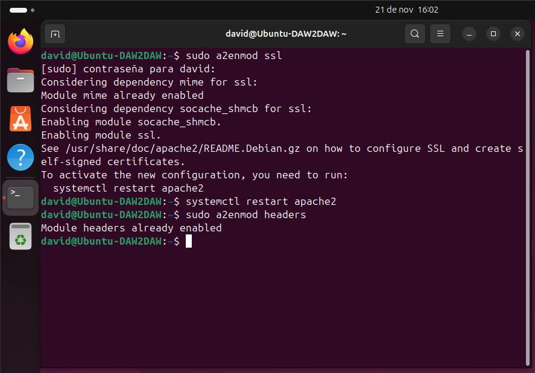
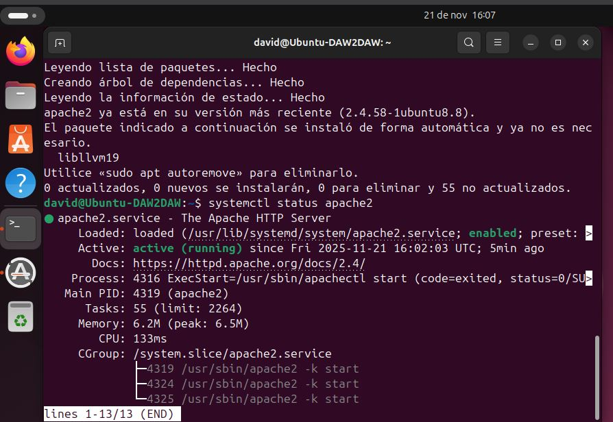
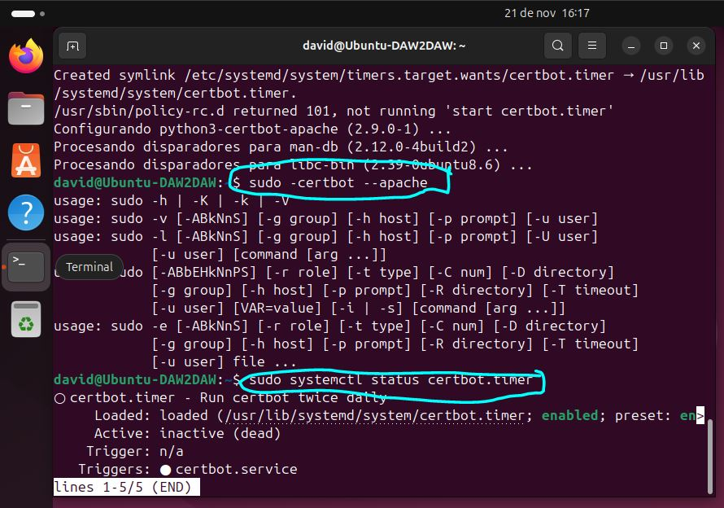

# Implementación de HTTPS en Apache2 sobre Ubuntu

## 1. Introducción

Este documento describe la investigación, configuración e implementación del protocolo **HTTPS** en un servidor **Apache2** ejecutándose sobre Ubuntu. Se detalla la parte teórica, los pasos técnicos realizados, así como la verificación final y conclusiones.

---

## 2. Investigación teórica

### 2.1 Funcionamiento del protocolo HTTPS

HTTPS (HyperText Transfer Protocol Secure) es la versión segura de HTTP. Utiliza una capa adicional de seguridad basada en **SSL/TLS**, la cual permite:

* **Cifrado**: Los datos entre cliente y servidor viajan encriptados.
* **Integridad**: Impide que la información sea alterada durante el transporte.
* **Autenticación**: Verifica que el servidor sea legítimo mediante certificados.

HTTPS funciona estableciendo un **handshake TLS**, donde cliente y servidor acuerdan algoritmos de cifrado y validan certificados antes de iniciar la transmisión segura.

### 2.2 Certificados SSL/TLS

Existen dos tipos principales:

#### ● Certificado autofirmado

* Generado manualmente por el propio administrador del servidor.
* Es válido a nivel técnico, pero **no es confiable por los navegadores**.
* Adecuado para entornos de pruebas o uso interno.

#### ● Certificado emitido por una CA (Autoridad Certificadora)

* Emitido por organizaciones como **Let’s Encrypt**, DigiCert, Sectigo...
* Reconocido automáticamente por navegadores y sistemas.
* Apto para servidores de producción.

### 2.3 Módulos de Apache necesarios para HTTPS

Para habilitar HTTPS en Ubuntu con Apache2 se requiere activar:

* **ssl** → Permite el uso de SSL/TLS.
* **headers** → Necesario para cabeceras de seguridad.

Comandos:

```
sudo a2enmod ssl
sudo a2enmod headers
```

---

## 3. Ejecución técnica

### 3.1 Instalación y verificación de Apache2

```
sudo apt update
sudo apt install apache2
systemctl status apache2
```

### 3.2 Activación de módulos SSL y headers

```
sudo a2enmod ssl
sudo a2enmod headers
sudo systemctl restart apache2
```

---

## 3.3 Generación del certificado SSL/TLS

### **Opción B: Certificado Let’s Encrypt (Certbot)**

1. Instalar Certbot:

```
sudo apt install certbot python3-certbot-apache
```

2. Ejecutar asistente automático:

```
sudo certbot --apache
```

3. Renovación automática:

```
sudo systemctl status certbot.timer
```

---

## 3.4 Configuración del VirtualHost para HTTPS (puerto 443)

Crear un archivo de configuración por ejemplo:

```
sudo nano /etc/apache2/sites-available/miweb-ssl.conf
```

Contenido:

```
<VirtualHost *:443>
    ServerName midominio.com

    DocumentRoot /var/www/html

    SSLEngine on
    SSLCertificateFile /etc/apache2/ssl/certificado.crt
    SSLCertificateKeyFile /etc/apache2/ssl/clave.key

    <Directory /var/www/html>
        AllowOverride All
    </Directory>

    Header always set Strict-Transport-Security "max-age=31536000"
</VirtualHost>
```

Habilitar el sitio:

```
sudo a2ensite miweb-ssl.conf
sudo systemctl reload apache2
```

---

## 3.5 Redirección HTTP → HTTPS (opcional pero recomendado)

Editar el sitio HTTP (port 80):

```
<VirtualHost *:80>
    ServerName midominio.com
    Redirect / https://midominio.com/
</VirtualHost>
```

Aplicar cambios:

```
sudo systemctl reload apache2
```

---

## 3.6 Validación del acceso HTTPS

### Con navegador

Acceder a:

```
https://IP-del-servidor
```

### Con curl

```
curl -I https://IP-del-servidor
```

Resultado esperado:

```
HTTP/2 200
```

Capturas de pantalla y resultados se deben incluir aquí.

---

## 4. Conclusiones

La implementación de HTTPS en Apache2 garantiza la seguridad del intercambio de información cifrada entre cliente y servidor. Durante el proceso se destacan puntos clave:

* Activación correcta de módulos SSL.
* Generación y uso adecuado de certificados.
* Configuración precisa de VirtualHosts y redirección segura.

La principal dificultad suele ser la gestión de certificados y errores en rutas o permisos, pero una vez configurado correctamente, el entorno HTTPS funciona de manera estable y segura.

---

## 5. Fuentes de información consultadas

* Documentación oficial de Apache HTTP Server: [https://httpd.apache.org/docs/](https://httpd.apache.org/docs/)
* Guía de SSL/TLS de Apache: [https://httpd.apache.org/docs/2.4/ssl/](https://httpd.apache.org/docs/2.4/ssl/)
* OpenSSL Documentation: [https://www.openssl.org/docs/](https://www.openssl.org/docs/)
* Certbot - Electronic Frontier Foundation: [https://certbot.eff.org/](https://certbot.eff.org/)
* Ubuntu Server Guide (Apache2): [https://ubuntu.com/server/docs/web-servers-apache](https://ubuntu.com/server/docs/web-servers-apache)

## 6. Anexos

* Output de comandos.
* Capturas de validación HTTPS.
