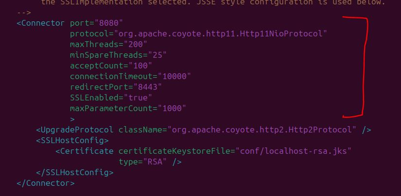

# Tomcat – Pruebas de funcionamiento y rendimiento

## 1. Objetivo
Evaluar el rendimiento del servidor Tomcat bajo carga y optimizar su configuración mediante ajustes en el archivo `server.xml`.

## 2. Pruebas iniciales(ApacheBench)

- n 1000 → 1000 peticiones totales
- c 10 → 10 peticiones concurrentes

```bash
ab -n 1000 -c 10 http://localhost:8080/
```


---

##3. Ajustes realizados en server.xml

Para ajustar el conector del arcivo ```server.xml```, debemos cambiar en el connector de la siguiente manera:



- ```maxThreads```: máximo de hilos simultáneos
- ```minSpareThreads```: hilos siempre disponibles
- ```acceptCount```: cola de peticiones
- ```connectionTimeout```: tiempo de espera

## 3. Conclusión

El ajuste de parámetros del conector HTTP mejora significativamente el rendimiento del servidor Tomcat, permitiendo gestionar mayor carga concurrente con menor latencia.
