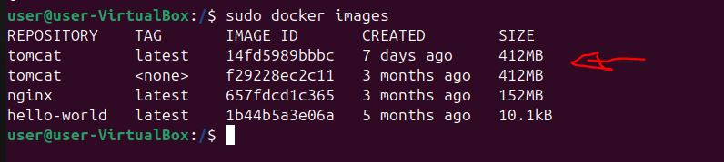

# Tomcat en Contenedores (Docker)

## 1. Introducción
Docker permite ejecutar Tomcat dentro de contenedores, proporcionando aislamiento, portabilidad y facilidad de despliegue frente a instalaciones tradicionales.

---

## 2. Descarga de la imagen oficial
Se descargó la imagen oficial de Tomcat desde Docker y se comprueba si la imagen ha sido descargada:

```bash
docker pull tomcat:latest
docker images
```


---

## 3. Ejecución del contenedor Tomcat
El contenedor se ejecutó exponiendo el puerto 8080:

```bash
docker run -d --name tomcat-container -p 8080:8080 tomcat:latest
```


PARTE 2 — Diferencias entre Tomcat nativo y Tomcat en Docker
### Tomcat nativo (instalado en el sistema)
- Se instala mediante APT.
- Usa rutas del sistema (/etc/tomcat10, /var/lib/tomcat10).
- Depende del sistema operativo anfitrión.
- Cambios persistentes.
- Ideal para servidores tradicionales.

### Tomcat en contenedor (Docker)
- Se ejecuta dentro de un contenedor aislado.
- No modifica el sistema anfitrión.
- Rutas internas propias (/usr/local/tomcat).
- Fácil de borrar, recrear y escalar.
- Ideal para desarrollo, pruebas y despliegues modernos.
