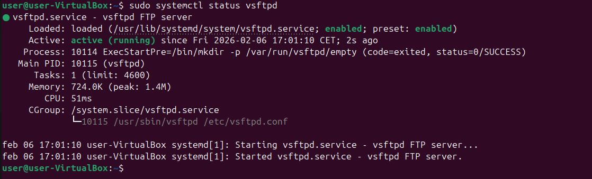

# Instalación y configuración inicial del servidor
### Objetivo
Instalar y configurar un servidor FTP en una máquina virtual con Ubuntu, realizando una configuración básica de red y servicio, y verificando su correcto funcionamiento.

FileZilla Server no está disponible en los repositorios oficiales de Ubuntu 24.04. Por este motivo, he decidido utilizar vsftpd (Very Secure FTP Daemon), que es el servidor FTP estándar y que cumple los mismos objetivos funcionales para el ejercicio.

## 1. Instalación del servidor FTP
### Instalación del servicio
```
sudo apt update
sudo apt install vsftpd
```

Una vez finalizada la instalación, el servicio queda instalado y registrado en el sistema.

## 2. Acceso a la consola de administración

En Ubuntu, la administración del servidor FTP se realiza mediante el archivo de configuración y los servicios del sistema, en lugar de una interfaz gráfica.

### Archivo de configuración principal
```
/etc/vsftpd.conf
```

Acceso mediante:
```
sudo nano /etc/vsftpd.conf
```
## 3. Configuración del servidor
3.1 Puerto de escucha

El protocolo FTP utiliza por defecto el puerto 21.

En el archivo /etc/vsftpd.conf se verifica o configura:
```
listen=YES
listen_port=21
```
### 3.2 Dirección IP

Para permitir conexiones desde cualquier interfaz de red de la máquina virtual:
```
listen_ipv6=NO
```
Esto fuerza el uso de IPv4 y evita conflictos de red.

### 3.3 Inicio automático del servicio

Para que el servidor FTP se inicie automáticamente al arrancar el sistema:
```
sudo systemctl enable vsftpd
```
## 4. Puesta en marcha y verificación
Comprobación del estado del servicio
```
sudo systemctl status vsftpd
```

