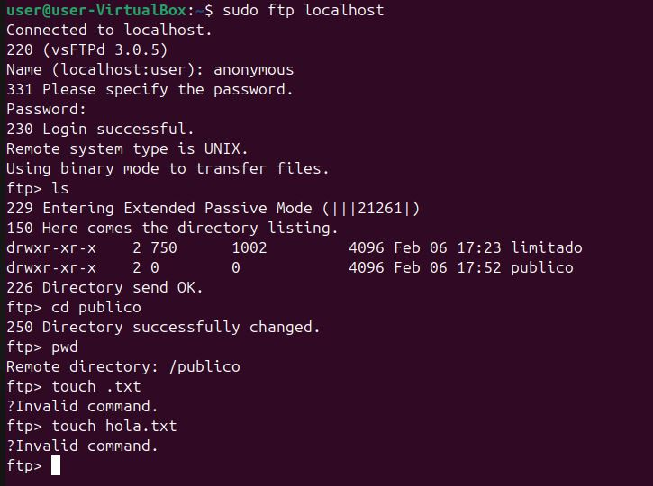

# Actividad 4: Configuración de acceso anónimo en el servidor FTP
### Objetivo

Configurar el servidor FTP para permitir acceso anónimo, restringiendo el directorio accesible y estableciendo permisos de solo lectura, garantizando así un acceso controlado y seguro.

## 1. Activación del acceso anónimo

Se edita el archivo de configuración principal de vsftpd:
```
sudo nano /etc/vsftpd.conf
```
Se añaden o modifican las siguientes directivas:
```
anonymous_enable=YES
local_enable=YES
write_enable=NO
```
Esto permite:

- Acceso anónimo al servidor
- Acceso de usuarios locales
- Evitar escritura global

## 2. Limitación del directorio accesible

El directorio por defecto para usuarios anónimos es `/srv/ftp`, así que se crea y asegura dicho directorio:
```
sudo mkdir -p /srv/ftp
sudo chown root:root /srv/ftp
sudo chmod 755 /srv/ftp
```
Opcionalmente, se puede crear una carpeta específica para contenido público:
```
sudo mkdir /srv/ftp/publico
sudo chmod 755 /srv/ftp/publico
```
Los usuarios anónimos solo podrán acceder a este directorio.

## 3. Establecimiento de permisos solo de lectura

Para asegurar que los usuarios anónimos no puedan subir ni borrar archivos, se configuran los siguientes parámetros:
```
anon_upload_enable=NO
anon_mkdir_write_enable=NO
anon_other_write_enable=NO
```
Esto garantiza:

- No subir archivos
- No crear directorios
- No borrar archivos

Para aplicar los cambios realizados es necesario reiniciciar el `vsftpd`.
## 5. Prueba de acceso anónimo
### Conexión desde un cliente FTP

Desde otra máquina o desde el mismo sistema:
```
ftp localhost
```
Cuando solicite usuario:
```
Name: anonymous
Password: (cualquier texto o dejar en blanco)
```
### Resultado esperado

- Conexión exitosa como usuario anónimo
- Acceso limitado al directorio `/srv/ftp`
- Posibilidad de listar y descargar archivos
- Imposibilidad de subir, modificar o borrar archivos



## Conclusión

El acceso anónimo permite la distribución pública de archivos sin necesidad de autenticación, siempre que se configure correctamente para evitar riesgos de seguridad.
