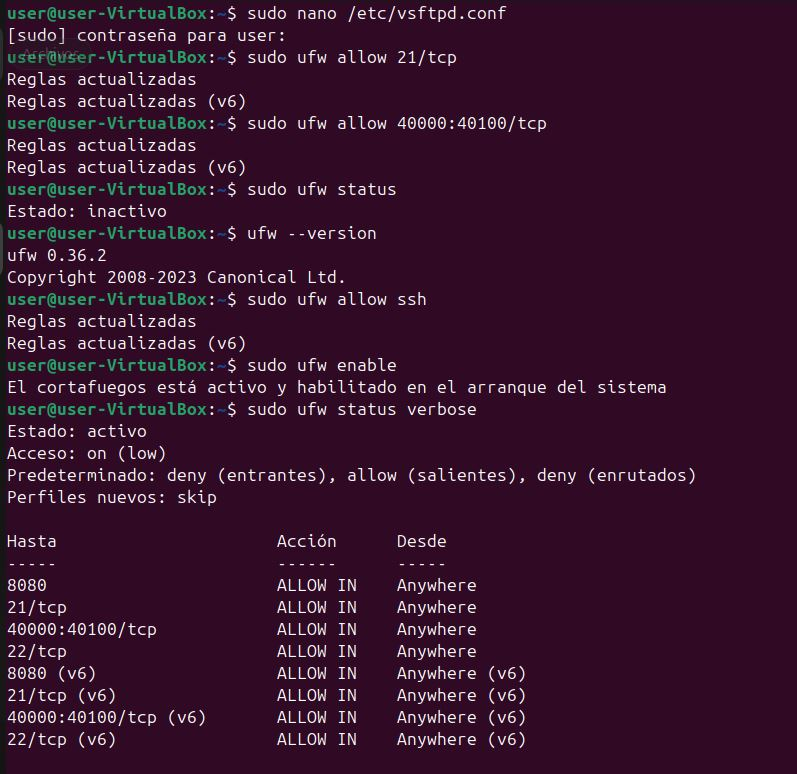

# Actividad 5: Pruebas en modo activo y pasivo en FTP
### Objetivo

Configurar el modo pasivo en el servidor FTP, realizar conexiones en modo activo y pasivo, y analizar cuál de ellos funciona mejor en redes protegidas por firewall.

## 1. Configuración del rango de puertos pasivos

Se edita el archivo de configuración de vsftpd:
```
sudo nano /etc/vsftpd.conf
```
Se añaden o modifican las siguientes directivas:
```
pasv_enable=YES
pasv_min_port=40000
pasv_max_port=40100
```
Opcionalmente, si el servidor está detrás de NAT:
```
pasv_address=localhost
```
## 2. Apertura de puertos en el firewall

Si está activo `ufw`, se abren los puertos necesarios:
```
sudo ufw allow 21/tcp
sudo ufw allow 40000:40100/tcp
```
Comprobación:
```
sudo ufw status verbose
```



Para aplicar los cambios, es necesario reinicar el `vsftpd`.

## 4. Pruebas de conexión.
### Conexión en modo activo

Entras como un cliente FTP y, una vez conectado:
```
ftp> passive off
ftp> ls
```
Resultado esperado:

En redes sin firewall restrictivo: funciona
En redes con firewall: posible fallo en la transferencia de datos

### Conexión en modo pasivo

Desde el cliente FTP:
```
ftp> passive on
ftp> ls
```
Resultado esperado:

Conexión correcta
Listado y transferencia de archivos sin errores

## 5. Análisis de funcionamiento con firewall
Observaciones

El modo activo requiere que el servidor inicie una conexión hacia el cliente
Muchos firewalls bloquean conexiones entrantes no solicitadas
El modo pasivo permite que el cliente inicie todas las conexiones

6. Entrega
Tabla comparativa: modo activo vs modo pasivo

| Característica                    | Modo activo                 | Modo pasivo                   |
| --------------------------------- | --------------------------- | ----------------------------- |
| Quién inicia la conexión de datos | Servidor                    | Cliente                       |
| Puertos utilizados                | Puerto dinámico del cliente | Rango definido en el servidor |
| Compatibilidad con firewall       | Baja                        | Alta                          |
| Uso en redes NAT                  | Problemático                | Recomendado                   |
| Seguridad                         | Menor control               | Mayor control                 |
| Uso habitual                      | Antiguo                     | Estándar actual               |

## Conclusión

El modo pasivo es el más adecuado en redes modernas con firewall y NAT, ya que todas las conexiones son iniciadas por el cliente, evitando bloqueos y problemas de conectividad.
